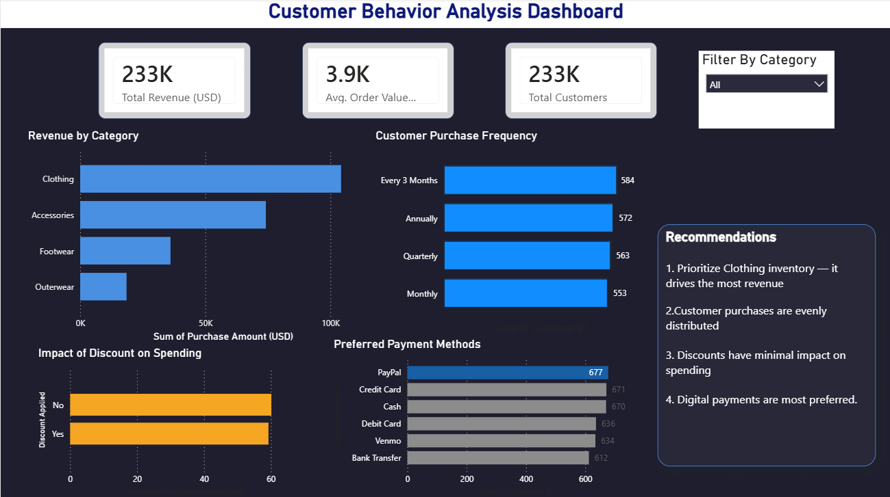

# 🛒 Customer Shopping Analysis Dashboard (Power BI)

🚀 Interactive Power BI dashboard for analyzing sales performance and customer behavior.

## 📌 Overview
📊 A data analytics dashboard to identify revenue drivers and customer behavior in an e-commerce business.

The dashboard provides a comprehensive view of business performance by analyzing revenue, customer behavior, and purchasing trends. It helps identify key drivers of sales and supports data-driven decision-making.

This dashboard is designed for business stakeholders, analysts, and decision-makers to monitor sales performance and customer behavior.

---

## 🎯 Objectives
- Analyze customer purchase behavior
- Identify top-performing product categories
- Understand payment preferences
- Evaluate the impact of discounts
- Improve business decision-making using data

---

## 📊 Dashboard Features

### 🔹 Key KPIs
- Total Revenue
- Average Order Value (AOV)
- Total Customers
- Repeat Purchase Rate

### 🔹 Analysis Sections
- Revenue by Category
- Purchase Frequency
- Payment Method Analysis
- Discount Impact

### 🔹 Interactive Filters
- Category filter
- Date filter

---

## 🧠 Key Insights
- Clothing category contributes the highest share of total revenue
- Most customers purchase quarterly
- Discounts have minimal impact on overall sales
- Digital payment methods are the most preferred by customers

---

## 🚀 Business Impact
- Helps optimize inventory planning
- Improves marketing strategies
- Reduces unnecessary discounting
- Enhances customer retention

---

## 🛠️ Tools & Technologies
- Power BI
- Power Query
- DAX (Data Analysis Expressions)

---

## 📂 Data Source
- Sample e-commerce dataset containing customer transactions, revenue, and payment details

## 📷 Dashboard Preview

---

## 📂 Project Structure

Customer-Shopping-Analysis/
├── customer_shopping_analysis.pbix
├── dashboard.png
└── README.md

## ▶️ How to Use
1. Download the `.pbix` file from the repository  
2. Open it in Power BI Desktop  
3. Use filters (category, date) to explore insights  

## 📌 Learnings
- Built KPI-driven dashboard using Power BI  
- Applied data visualization best practices  
- Improved data storytelling and business analysis skills  

## ⭐ Project Highlights
- Interactive and user-friendly dashboard design  
- KPI-driven analysis for business insights  
- Real-world business problem solving approach  

## 🔮 Future Improvements
- Add time-series analysis for trend forecasting  
- Include customer segmentation  
- Enhance dashboard with drill-through analysis  

## 🤝 Connect
Feel free to connect with me for feedback or collaboration opportunities.
